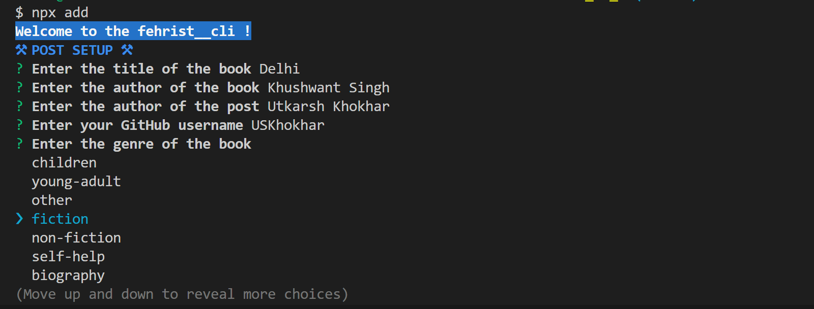
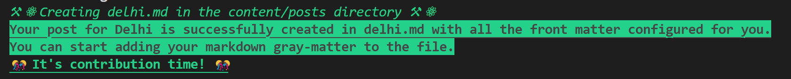

Contributing to fehrist  📝
=======================

Welcome to the world of literary exploration and contribution! We're thrilled that you want to be a part of Fehrist, the open-source catalogue of book synopses. Your contribution will help expand our literary universe and bring the joy of reading to many.

## Getting Started 🚀

Before you embark on your journey as a contributor, let's ensure you have everything set up and ready to roll.


## Types of Contributions ⚛ 
---

You can contribute to fehrist in the following ways:

*   **Synopses:** Submit synopses posts of new books and expand the catalogue.
*   **Feature/UI:** Submit bug fixes, implement new features, or improve existing functionality & UI.
*   **Bug Reports:** Report bugs by creating detailed issue reports with clear steps to reproduce.

## Requirements 👨‍💻 

To contribute to **fehrist**, you will need the following:
*   Github Account
*   Git
*   Node
*   NPM

> - If you don't have Node.js, [install it here](https://nodejs.org/). NPM comes bundled with Node.js.

Once everything is setup, you are good to go with following steps:

### 1. Create an Issue 📜
- Head over to the [Main Repo Issues](https://github.com/USKhokhar/fehrist/issues) and create a new issue to add a new post.
- Once the issue is assigned to you, you may proceed further.

### 2. Fork and Clone 🍴 
- First, fork the repository to your GitHub account. This will create your personal copy.
- Now, clone your forked repository to your local machine.

```bash
    git clone https://github.com/{YOUR_GITHUB_USERNAME}/fehrist.git
```
- After cloning, do not forget to create a new branch for your changes, you can do so by running:

```bash
    git checkout -b YOUR_BRANCH_NAME
```


### 4. Install Dependencies ⬇ 
- Navigate to your project directory.
- Open your terminal and run:

```bash
  npm install
```
- This will install all the required node dependencies.

### 5. Start The Local Server 🔧 

- Start the local server to test the project locally by running:

```bash
    npm run dev
```
- This should start a local instance on your system at `localhost:4321`

### 6. Adding A New Post 📖 

- Once your local server is running, you are ready to add the post for your selected book. To add it simply go to your terminal and run:

```bash
    npx add
```
- This should introduce you to some CLI prompts as shown in this picture


- Upon entering all details, you should receive a message like this:



### 7. Adding Content To Your Post ✍ 

- After running npx add, a markdown file is created in the src/content/posts directory.
- You can navigate to it, or if you're a VSCode user, use the shortcut CTRL + P and search for the file name.
- Open the markdown file and add the content of your book synopsis.
- Need inspiration? You can get the book's synopsis from GoodReads, Amazon, or any other reliable source.

### 8. Commit Time! 🔼 

- Once you've added and edited your content, it's time to contribute!
- Use the following Git commands to add, commit, and push your changes:

```bash
    git add .
    git commit -m "YOUR_NAME: YOUR_BOOK_TITLE"
    git push -u origin YOUR_BRANCH_NAME
```

- Now, go back to your GitHub fork and open a Pull Request (PR). We'll review your contribution and, if all is well, merge it into the main project.

---

🎊 Congratulations! 🎊  You've just made your contribution to the world of books and knowledge. 

Happy contributing! 📚✍️